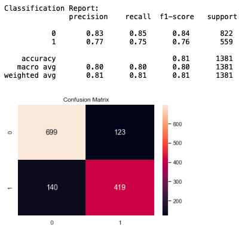
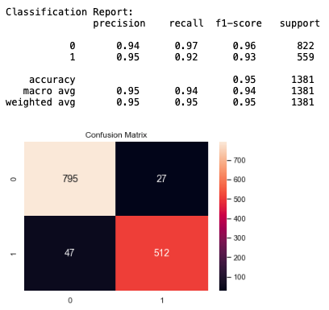
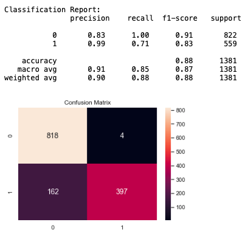

# Spam Email Classifier Using NaiveBayes and XGBoost Classifiers

This is a project I am working on while learning concepts of data science and machine learning. The goal here is to identify whether an email is spam or ham. We will take a dataset of labeled email messages and apply classification techniques. We can later test the model for accuracy and performance on unclassified email messages. Similar techniques can be applied to other NLP applications like sentiment analysis etc.

## Data

I am using Spambase dataset from [UCI's ML Repository](https://archive.ics.uci.edu/ml/datasets/Spambase) which can be downloaded from the link.

The last column of 'spambase.data' denotes whether the e-mail was considered spam (1) or not (0), i.e. unsolicited commercial e-mail. Most of the attributes indicate whether a particular word or character was frequently occuring in the e-mail. The run-length attributes (55-57) measure the length of sequences of consecutive capital letters. Here are the definitions of the attributes:

- 48 continuous real [0,100] attributes of type word_freq_WORD
= percentage of words in the e-mail that match WORD, i.e. 100 * (number of times the WORD appears in the e-mail) / total number of words in e-mail. A "word" in this case is any string of alphanumeric characters bounded by non-alphanumeric characters or end-of-string.

- 6 continuous real [0,100] attributes of type char_freq_CHAR]
= percentage of characters in the e-mail that match CHAR, i.e. 100 * (number of CHAR occurences) / total characters in e-mail

- 1 continuous real [1,...] attribute of type capital_run_length_average
= average length of uninterrupted sequences of capital letters

- 1 continuous integer [1,...] attribute of type capital_run_length_longest
= length of longest uninterrupted sequence of capital letters

- 1 continuous integer [1,...] attribute of type capital_run_length_total
= sum of length of uninterrupted sequences of capital letters
= total number of capital letters in the e-mail

- 1 nominal {0,1} class attribute of type spam
= denotes whether the e-mail was considered spam (1) or not (0), i.e. unsolicited commercial e-mail.

## Model

We use Multinomial Naive Bayes Classifier and then XGBoost Classifier to fit the model looking for improvement in results. In the end, the accuracy score and confusion matrix tell us how well our model works.

### Multinomial Naive Bayes Classifier

In statistics, Naïve Bayes classifiers are a family of simple "probabilistic classifiers" based on applying Bayes' theorem with strong (naïve) independence assumptions between the features. They are among the simplest Bayesian network models. Naïve Bayes classifiers are highly scalable, requiring a number of parameters linear in the number of variables (features/predictors) in a learning problem.

With a multinomial event model, samples (feature vectors) represent the frequencies with which certain events have been generated by a multinomial  where    is the probability that event i occurs (or K such multinomials in the multiclass case). A feature vector    is then a histogram, with    counting the number of times event i was observed in a particular instance. This is the event model typically used for document classification, with events representing the occurrence of a word in a single document (see bag of words assumption). The likelihood of observing a histogram x is given by

The multinomial naïve Bayes classifier becomes a linear classifier when expressed in log-space:

where    and  .

### XGBoost Regressor

XGBoost is an optimized distributed gradient boosting library designed to be highly efficient, flexible and portable. It implements machine learning algorithms under the Gradient Boosting framework. XGBoost provides a parallel tree boosting (also known as GBDT, GBM) that solve many data science problems in a fast and accurate way. The same code runs on major distributed environment (Hadoop, SGE, MPI) and can solve problems beyond billions of examples.

## Results

The model outputs accuracy of ~81% using MultinomialNB Classifier where I had about 10% of test results classified False Possitively. 

To reduce this, I then applied XGBoost Regressor and achieved accuracy upwards of 94%, which is decent enough. We have less than 2% false positive and 3.5% false negative classification.

Upon restricting to classify for False Positive results, we achive a reduced accuracy of 88%.

## Future Work
I intend to expend this project by adding a graphical user interface (GUI) where one can connect their email inbox directly to the model and get their emails classified into different collections.
